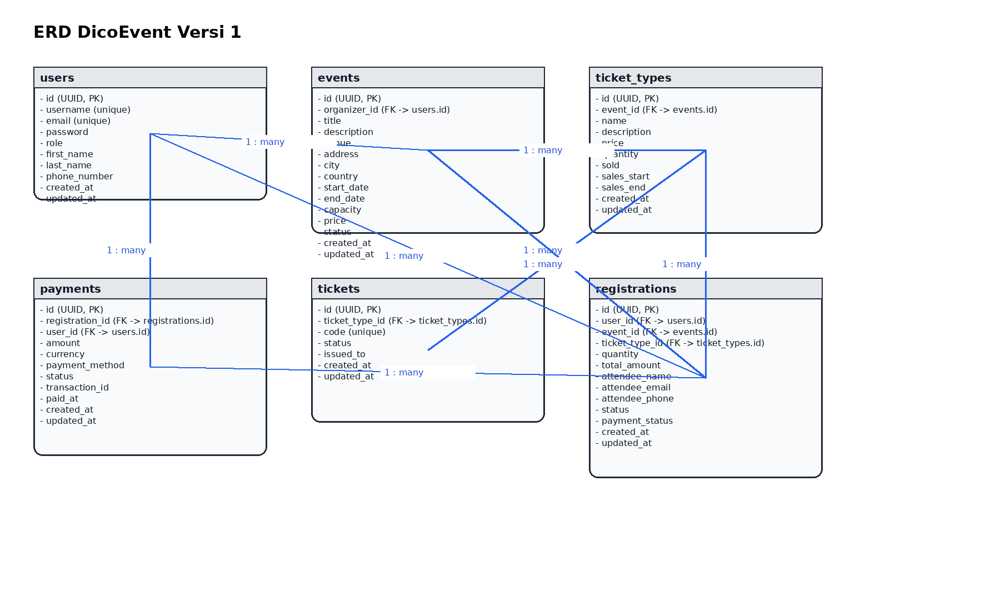

# DicoEvent - Event Management System (Version 1)

A RESTful API for managing events, tickets, registrations, and payments built with Django and Django REST Framework.

## Features

### Authentication & Authorization

- JWT-based authentication
- Role-based access control (RBAC) with 4 roles:
  - **Super User**: Full access to all features
  - **Admin**: Manage events, tickets, registrations, and payments
  - **Organizer**: Manage own events and tickets
  - **User**: Register for events and manage own registrations

### Core Functionality

- **Events Management**: Create, update, publish, and cancel events
- **Ticket Management**: Define ticket types and generate individual tickets
- **Registration System**: Handle event registrations with payment integration
- **Payment Processing**: Track payment status and handle refunds

## Project Structure

```text
dicoevent/
├── dicoevent_project/     # Main Django project
├── users/                 # User management app
├── events/                # Event management app
├── tickets/               # Ticket management app
├── registrations/         # Registration management app
├── payments/              # Payment processing app
├── Pipfile               # Dependencies
├── .env                  # Environment variables (ignored)
├── .env.example          # Environment variables template
├── .gitignore            # Git ignore rules
└── README.md             # This file
```

## Environment Setup

### 1. Environment Variables

Copy the example environment file and configure your settings:

```bash
cp .env.example .env
```

Then edit `.env` with your actual configuration:

```env
# Database Configuration
DATABASE_NAME=dicoevent_db
DATABASE_USER=dicoevent_user
DATABASE_PASSWORD=secure_password_123
DATABASE_HOST=localhost
DATABASE_PORT=5432

# Django Settings
SECRET_KEY=your-secret-key-here-change-in-production
DEBUG=True
ALLOWED_HOSTS=localhost,127.0.0.1

# JWT Settings
JWT_ACCESS_TOKEN_LIFETIME_HOURS=3
```

### 2. Prerequisites

- Python 3.10
- PostgreSQL database
- pipenv (recommended) or pip

### 3. Installation

1. **Clone and navigate to project directory**

```bash
cd dicoevent
```

1. **Install dependencies**

```bash
pipenv install
# or
pip install -r requirements.txt
```

1. **Set up environment variables**
Create a `.env` file with the following:

```env
# Database Configuration
DATABASE_NAME=dicoevent_db
DATABASE_USER=dicoevent_user
DATABASE_PASSWORD=secure_password_123
DATABASE_HOST=localhost
DATABASE_PORT=5432

# Django Settings
SECRET_KEY=your-secret-key-here-change-in-production
DEBUG=True
ALLOWED_HOSTS=localhost,127.0.0.1

# JWT Settings
JWT_ACCESS_TOKEN_LIFETIME_HOURS=3
```

1. **Run database migrations**

```bash
python manage.py makemigrations
python manage.py migrate
```

1. **Create initial data**

```bash
python create_initial_data.py
```

1. **Start the development server**

```bash
python manage.py runserver
```

The API will be available at `http://localhost:8000`

## API Endpoints

### Authentication

- `POST /api/register/` - Register new user
- `POST /api/login/` - Login and get JWT tokens

### Users

- `GET /api/users/` - List all users (admin/superuser only)
- `GET /api/users/{id}/` - Get user details
- `PUT/PATCH /api/users/{id}/` - Update user profile
- `DELETE /api/users/{id}/` - Delete user (admin/superuser only)
- `PATCH /api/users/{id}/role/` - Update user role (admin/superuser only)

### Events

- `GET /api/events/` - List all events
- `POST /api/events/` - Create new event
- `GET /api/events/{id}/` - Get event details
- `PUT/PATCH /api/events/{id}/` - Update event
- `DELETE /api/events/{id}/` - Delete event
- `GET /api/events/upcoming/` - Get upcoming events
- `GET /api/events/my-events/` - Get events organized by current user
- `PATCH /api/events/{id}/publish/` - Publish event
- `PATCH /api/events/{id}/cancel/` - Cancel event

### Tickets

- `GET /api/ticket-types/` - List all ticket types
- `POST /api/ticket-types/` - Create new ticket type
- `GET /api/ticket-types/{id}/` - Get ticket type details
- `PUT/PATCH /api/ticket-types/{id}/` - Update ticket type
- `DELETE /api/ticket-types/{id}/` - Delete ticket type
- `GET /api/events/{event_id}/ticket-types/` - Get ticket types for event
- `POST /api/ticket-types/{id}/generate/` - Generate individual tickets
- `GET /api/tickets/` - List all individual tickets
- `GET /api/tickets/validate/{code}/` - Validate ticket by code
- `POST /api/tickets/use/{code}/` - Mark ticket as used

### Registrations

- `GET /api/registrations/` - List all registrations
- `POST /api/registrations/` - Create new registration
- `GET /api/registrations/{id}/` - Get registration details
- `PUT/PATCH /api/registrations/{id}/` - Update registration
- `DELETE /api/registrations/{id}/` - Delete registration
- `GET /api/registrations/my/` - Get current user's registrations
- `GET /api/events/{event_id}/registrations/` - Get event registrations
- `PATCH /api/registrations/{id}/status/` - Update registration status
- `POST /api/registrations/{id}/cancel/` - Cancel registration

### Payments

- `GET /api/payments/` - List all payments
- `POST /api/payments/` - Create new payment
- `GET /api/payments/{id}/` - Get payment details
- `PUT/PATCH /api/payments/{id}/` - Update payment
- `DELETE /api/payments/{id}/` - Delete payment
- `GET /api/payments/my/` - Get current user's payments
- `POST /api/payments/initiate/` - Initiate payment for registration
- `PATCH /api/payments/{id}/status/` - Update payment status
- `POST /api/payments/{id}/refund/` - Refund payment

## Testing with Postman

The project includes Postman collections for testing:

1. Import the Postman collection from `[788]_DicoEvent_Versi_1_Postman_(1)/`
2. Set up the environment variables in Postman
3. Run the test collection to verify API functionality

## Database Design

### Entity Relationship Diagram (ERD)

The system includes the following main entities:

- **Users**: Custom user model with roles
- **Events**: Event information and scheduling
- **TicketTypes**: Different ticket categories for events
- **Tickets**: Individual ticket instances
- **Registrations**: User event registrations
- **Payments**: Payment processing and tracking



## Security Features

- UUID primary keys for enhanced security
- JWT authentication with 3-hour token lifetime
- Role-based access control
- Environment variable configuration
- Input validation and sanitization
- Unique constraints on critical fields

## Best Practices Implemented

- ✅ PostgreSQL database with proper indexing
- ✅ UUID primary keys
- ✅ Environment variable configuration
- ✅ JWT authentication with proper token lifetime
- ✅ Role-based access control
- ✅ Proper error handling and validation
- ✅ RESTful API design principles
- ✅ Comprehensive documentation
- ✅ Database constraints and validations
- ✅ Secure password handling

## Requirements Met

This implementation satisfies all submission criteria:

### Criteria 1: Database Implementation (4/4 points)

- ✅ Uses PostgreSQL database
- ✅ Environment variables for database credentials
- ✅ UUID primary keys
- ✅ Advanced Django ORM usage with constraints
- ✅ Normalized database design
- ✅ Unique constraints implemented

### Criteria 2: Authentication & Authorization (4/4 points)

- ✅ JWT authentication implementation
- ✅ Role-based access control (user, organizer, admin, superuser)
- ✅ 3-hour JWT token lifetime
- ✅ Custom User model
- ✅ Custom permissions implementation
- ✅ Proper authorization checks

## License

This project is part of a Dicoding submission and follows their academic integrity guidelines.
